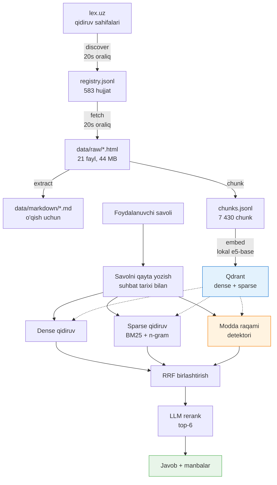

# Loyiha holati

**Sana:** 2026-07-27 · **Oxirgi commit:** `3123a58`

---

## 1. Bir qarashda

Tizim **ishlayapti va foydalanishga tayyor**. Konstitutsiya va 20 ta kodeks
to'liq indexlangan, savol berib manba havolali javob olish mumkin.

| Ko'rsatkich | Qiymat |
|---|---|
| Indexlangan hujjatlar | 21 (Konstitutsiya + 20 kodeks) |
| Reyestrda ro'yxatga olingan | 583 (yuqoridagilar + 562 qonun) |
| Moddalar | 7 237 |
| Qidiruv birliklari (chunk) | 7 430 |
| Qidiruv sifati (recall@5) | **1.00** |
| Bosqichlar | 12 dan 9 tasi tugagan |
| Kod | 45 fayl, 8 commit |
| Disk | 86 MB |

---

## 2. Biz qayerdamiz

```mermaid
graph LR
    subgraph done ["TUGAGAN"]
        S0["0. Skelet<br/>Docker + Qdrant"]
        S1["1. Reyestr<br/>583 hujjat"]
        S2["2. Yuklash<br/>21 hujjat"]
        S3["3. Ajratish<br/>7 430 chunk"]
        S4["4. Indexatsiya<br/>7 430 nuqta"]
        S5["5. Retrieval<br/>recall@5 = 1.00"]
        S6["6. Javob<br/>manbali"]
        S7["7. Backend<br/>6 endpoint"]
        S8["8. Frontend<br/>chat UI"]
    end

    subgraph now ["HOZIR SHU YERDA"]
        P["Tizim ishlayapti<br/>localhost:8000"]
    end

    subgraph todo ["QOLGAN"]
        S9["9. Qolgan hujjatlar<br/>562 qonun + 11 405"]
        S10["10. Baholash + Deploy<br/>50 savol, Docker"]
        S11["11. Avto-yangilanish<br/>kunlik tekshiruv"]
        S12["12. Tool calling<br/>agentik rejim"]
    end

    S0 --> S1 --> S2 --> S3 --> S4 --> S5 --> S6 --> S7 --> S8 --> P
    P --> S9 --> S10 --> S11 --> S12

    style done fill:#e8f5e9,stroke:#4caf50
    style now fill:#fff8e1,stroke:#ffa726,stroke-width:3px
    style todo fill:#eceff1,stroke:#90a4ae
    style P fill:#ffe082,stroke:#f57c00,stroke-width:2px
```



### Ma'lumot quvuri qanday ishlaydi



---

## 3. Nimalar qilindi

### Bosqich 0 — Skelet va infratuzilma
Papka strukturasi, `venv`, `docker-compose.yml` (Qdrant, `mem_limit: 2g`,
`on_disk_payload`), `.env`, FastAPI `/health`. Python 3.12 ishlatildi
(mashinada 3.11 yo'q edi).

### Bosqich 1 — lex.uz reyestri
Sayt tuzilishi o'rganildi. **lex.uz sahifalashi oddiy `?page=2` emas** —
ASP.NET WebForms, keyingi sahifa `__VIEWSTATE` bilan POST qilinadi. Client
`robots.txt` ni o'qiydi va undagi `Crawl-delay: 20` ga rioya qiladi,
javoblarni keshlaydi, 429/5xx da backoff qiladi.

### Bosqich 2 — Hujjatlarni yuklash
21/21 hujjat xatosiz yuklandi. Uzilishdan davom etadi, xatolar
`failed.jsonl` ga yoziladi va qayta urinib ko'riladi.

### Bosqich 3 — Matn ajratish va chunking
**Eng ko'p vaqt olgan va eng ko'p xato topilgan bosqich.**

- **881 ta modda `<sup>` bilan raqamlangan** (173²-modda). Oddiy matn
  ajratishda ular "173 2 -modda" bo'lib buziladi va haqiqiy 173-modda bilan
  chalkashadi. Endi `article_no: "173-2"`, `article_no_display: "173²"`.
- Sarlavha shakllari ikki xil: `24⁵-modda` va `24 ⁵ -modda`.
- Tahrir qilingan hujjatlarda bo'sh sarlavha bloklari qolib ketadi —
  ular yangi modda boshlamasligi kerak.
- **OKOZ va TSZ ikki xil klassifikator ekan**, bir xil HTML blokida keladi.
  Ajratildi: OKOZ batafsil, TSZ yiriklashtirilgan (agent rejimlari uchun).
- Hujjat sanalari `<title>` va header'dan olinadi — reyestr shu bilan
  boyitildi (21/21 hujjatda ikkala sana ham bor).

Tekshiruv: 200 ta tasodifiy anchor havola xom HTML bilan solishtirildi —
200/200 mavjud. 383 ta modda raqami Markdown sarlavhalari bilan
solishtirildi — 0 nomuvofiqlik.

### Bosqich 4 — Indexatsiya
Qdrant kolleksiyasi: dense (768, cosine, `on_disk`) + sparse (BM25,
`IDF` modifikatori, `on_disk`). Payload indekslari 9 ta maydonda.
Embeddinglar diskka keshlanadi, upsert `chunk_id` bo'yicha idempotent.

**Sparse kodlashda o'zbek tili muammosi:** so'rovda `poytaxt`, matnda
`poytaxti` — agglyutinativ qo'shimchalar tufayli aniq so'z mosligi nol
beradi. Sakkizta strategiya o'lchandi, g'olib: to'liq so'z + 4-belgili
n-gramma. MRR 0.327 → 0.475.

### Bosqich 5 — Gibrid retrieval
Dense + sparse + RRF (`1/(60+rank)`), modda raqami detektori, kodeks
qisqartmalari lug'ati (FK, JK, MK, SK...), LLM orqali so'rov kengaytirish.

### Bosqich 6 — Rerank va javob
Top-20 bitta so'rovda 0-10 ball bilan baholanadi, top-6 tanlanadi.
System prompt qat'iy: faqat kontekst, har da'voda manba, topilmasa
ochiq aytish. Rerank ishlamay qolsa retrieval tartibi saqlanadi.

### Bosqich 7 — Backend
6 endpoint, 7 agent rejimi, SQLite suhbat tarixi, follow-up savollarni
qayta yozish, rate limiting, strukturalangan logging.

### Bosqich 8 — Frontend
Vanilla JS chat: streaming javob, agent tanlash, manbalar ro'yxati,
modda matni modalda, hujjatlar bo'limi, mobil va tungi rejim.

---

## 4. Muhim texnik qarorlar

### Embedding lokal modelda ishlaydi
Gemini bepul tarifi kuniga 1 000 embedding so'roviga ruxsat beradi
(`EmbedContentRequestsPerDayPerProjectPerModel-FreeTier`), bu korpus uchun
7 kun degani. Uchta lokal model o'lchandi:

| Model | O'lchov | recall@5 | MRR |
|---|---:|---:|---:|
| **multilingual-e5-base** | 768 | **0.80** | **0.595** |
| multilingual-e5-small | 384 | 0.50 | 0.417 |
| paraphrase-multilingual-MiniLM | 384 | 0.10 | 0.114 |

`e5-base` tanlandi. Butun korpus 53 daqiqada indexlandi, kvota yo'q,
internet kerak emas, pul ketmaydi.

### LLM modellari o'rtasida avtomatik almashish
Bepul tarifda har bir model kuniga **20 ta** so'rovga ruxsat beradi
(`GenerateRequestsPerDayPerProjectPerModel-FreeTier`). Har bir modelning
o'z alohida hisobi bor, shuning uchun tizim bittasi tugaganda o'zi
keyingisiga o'tadi. Zanjirda 6 model ≈ 120 so'rov/kun.

---

## 5. Qidiruv sifati (15 savol, `eval/questions.jsonl`)

| Rejim | recall@5 | recall@10 | MRR |
|---|---:|---:|---:|
| **hybrid** | **1.00** | **1.00** | **0.828** |
| dense | 0.60 | 0.73 | 0.523 |
| sparse | 0.60 | 0.80 | 0.467 |

Savol turlari bo'yicha (hybrid):

| Tur | n | recall@5 | MRR |
|---|---:|---:|---:|
| semantik | 7 | 1.00 | 0.810 |
| modda raqami | 5 | 1.00 | 1.000 |
| kodeks nomi | 3 | 1.00 | 0.583 |

**Gibrid arxitektura o'zini oqladi:** modda raqamli savollarda sof vector
qidiruv recall@5 = 0.00 beradi (ya'ni umuman ishlamaydi), gibrid esa 1.00.

---

## 6. Qolgan ishlar

### Bosqich 9 — Qolgan hujjatlarni qo'shish

Reyestrda 562 qonun tayyor, matnlari yuklanmagan. Qolgan guruhlar hali
ro'yxatga ham olinmagan.

| Guruh | Hujjat | Yuklash vaqti | Holat |
|---|---:|---:|---|
| 3. Qonunlar | 562 | ~3.1 soat | Reyestr tayyor |
| 6. Sud amaliyoti | 565 | ~3.1 soat | Boshlanmagan |
| 4. Prezident hujjatlari | 3 526 | ~19.6 soat | Boshlanmagan |
| 5. Hukumat qarorlari | 4 588 | ~25.5 soat | Boshlanmagan |
| 7. Idoraviy hujjatlar | 1 216 | ~6.8 soat | Boshlanmagan |
| 8. Xalqaro hujjatlar | 1 510 | ~8.4 soat | Boshlanmagan |
| **Jami** | **11 967** | **~67 soat** | |

Yuklash vaqti lex.uz `robots.txt` dagi 20 soniyalik talab bilan
belgilanadi va uni tezlashtirib bo'lmaydi (IP bloklanish xavfi).
Extract va indexatsiya bunga qo'shimcha ~20 soat.

Tavsiya etilgan tartib: **3 → 6** (qiymat yuqori, jami 6 soat), keyin
qolganlari. Yuklash fonda ishlaydi va tizimdan foydalanishga xalaqit
bermaydi.

### Bosqich 10 — Baholash va deploy
Savollarni 50 tagacha kengaytirish, `backend/Dockerfile`,
`docker-compose.yml` ga backend qo'shish, `scripts/backup.sh`,
to'liq README.

### Bosqich 11 — Avtomatik yangilanish
lex.uz `pub_date=today` sahifasini kuzatish, `content_hash` bo'yicha
o'zgarishni aniqlash, faqat o'zgargan moddalarni qayta embedding qilish,
APScheduler, hisobotlar, xavfsizlik chegaralari.

### Bosqich 12 — Tool calling
LLM ga qidiruv, modda olish, hujjat ro'yxati vositalarini berish.

---

## 7. Ochiq masalalar

**Kirill hujjatlar sinalmagan.** Transliteratsiya funksiyasi yozilgan,
lekin 21 hujjatning hammasi lotin yozuvida bo'lgani uchun haqiqiy
ma'lumotda tekshirilmagan. 4-5-guruhlarda kerak bo'ladi.

**LLM kvotasi cheklangan.** Bepul tarifda ~120 so'rov/kun. Ko'p
foydalanuvchiga ochish uchun billing kerak (`gemini-embedding-001`
uchun 1M token = $0.15, minimal to'lov $10).

Kvotani tejash uchun `.env` ga:
```
ENABLE_QUERY_EXPANSION=false
ENABLE_RERANK=false
```
Bunda har savolga 3 tadan 1 ta LLM chaqiruvi qoladi (~360 savol/kun).

**API kalit almashtirilishi kerak.** Chatda ochiq yuborilgan.

---

## 8. Ishga tushirish

```bash
docker compose up -d
uvicorn backend.app.main:app --host 0.0.0.0 --port 8000
```

Brauzerda: **http://localhost:8000**

Foydali buyruqlar:
```bash
python parser/run_discover.py --group 3   # ro'yxat yig'ish
python parser/run_fetch.py --group 3      # matnlarni yuklash
python parser/run_extract.py --group 3    # ajratish va chunking
python scripts/index.py --group 3         # indexatsiya
python eval/run.py --verbose              # sifatni o'lchash
```
