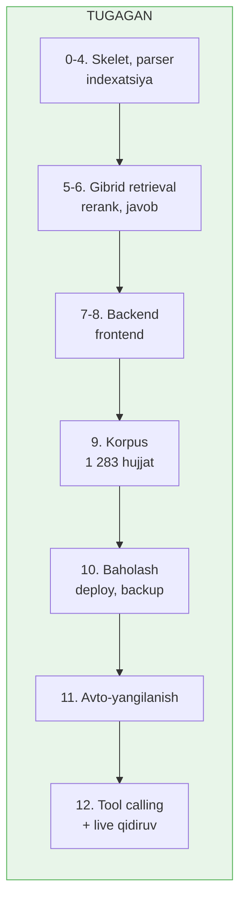

# Loyiha holati

**Sana:** 2026-07-29 · **Oxirgi commit:** `91522ee` dan keyingi UI-sinov seansi

---

## 1. Bir qarashda

Tizim ishlayapti va foydalanishga tayyor. Barcha 12 bosqich yozilgan, oldingi
seansdagi ochiq muammolarning kattasi yopildi.

| Ko'rsatkich | Qiymat |
|---|---|
| Reyestrda ro'yxatga olingan | **1 283 hujjat** |
| Yuklangan va chunklangan | 1 283 (100%) |
| Indexlangan chunk | **22 513** (korpus to'liq indexlangan) |
| Noyob modda | 19 333 |
| Qidiruv sifati (recall@5, gibrid) | **0.96** (70 savol) |
| recall@10 | **1.00** |
| Bosqichlar | 12 dan 12 tasi yozilgan |

Bu seansda (2026-07-29): tizim wakil.ai bilan solishtirilib uchta kamchilik yopildi.
1. **Suhbatdosh javob** — "qanday yordam bera olasan?", salomlashish kabi
   meta-savollar endi "topilmadi" o'rniga imkoniyatlar haqida javob oladi
   (`generate.py` dagi `META_RE` detektori retrieval'ni chetlab o'tadi).
2. **Tahlil rejimi** — foydalanuvchi vaziyati yoki sud qarori bo'yicha maslahat
   so'ralganda javob Xulosa / Huquqiy asos / Tavsiya tuzilishida keladi.
3. **Fayl yuklash** — PDF/rasm Gemini'ga inline boradi, DOCX/TXT matni lokal
   ajratiladi (`attachments.py`); bir LLM o'tishi hujjatdan xulosa va qidiruv
   so'rovlarini chiqaradi, shu so'rovlar bilan baza qidirilib javob beriladi.
4. **UI** — wakil.ai uslubidagi sidebar (logo, Yangi suhbat, Agentlar), vaqtga
   qarab salomlashuv ekrani, fayl biriktirish, markdown render, mobil menyu.

Shu kuni ikkinchi seansda foydalanuvchining 12 ta UI/UX so'rovi bajarildi va
sinovdan o'tkazildi (`YANGILANISHLAR.md` da to'liq ro'yxat): suhbat tarixi va
sahifa yangilanganda tiklanish, manbalar 4 taga qisqarib faqat iqtibos
qilinganlari qoladigan bo'ldi (`filter_cited_sources`), tungi/kunduzgi/tizim
rejimlari, halqa ko'rinishidagi Agent rejimi tugmasi, yig'iladigan Agentlar
bo'limi, global qidiruv oynasi, javobdan ajratilgan disclaimer bloki.
Sinovlar: sessiya API'lari curl bilan, UI `scripts/ui_check.py` (Playwright,
12/12) bilan, manba filtri ikki jonli savolda tekshirildi.

Oldingi seansda: agentik rejim live qidiruvga o'tadigan bo'ldi, Plenum qarorlari
topildi (4 tadan 185 taga), qidiruv sifati 0.94 → 0.96 ga ko'tarildi.
Qolgan ishlar `VAZIFALAR.md` da.

---

## 2. Korpus tarkibi

| Guruh | Hujjat | Chunk | Indexlangan |
|---|---:|---:|---:|
| Konstitutsiya | 1 | 156 | 156 |
| Kodekslar | 20 | 7 274 | 7 274 |
| Qonunlar | 562 | 12 819 | 12 819 |
| Sud amaliyoti (alohida ishlar) | 515 | 1 231 | 1 231 |
| **Oliy sud / Plenum (9-guruh)** | **185** | **1 033** | **1 033** |

Endi korpusning hammasi indexlangan — avval indexdan tashqarida turgan 545 ta
alohida ish qarori ham qo'shildi. Qo'shishdan oldingi xavotir (qidiruv shovqini)
o'lchov bilan tekshirildi: recall@5 va recall@10 o'zgarmadi, MRR 0.803 dan 0.814
ga **ko'tarildi**. Ya'ni ular zarar qilmadi.

Prezident hujjatlari, hukumat qarorlari, idoraviy va xalqaro hujjatlar
(~10 800 hujjat) rejadan chiqarildi — sabab `VAZIFALAR.md` da.

### 9-guruh: Plenum qarorlari qayerda ekan

`/uz/search/court` tabi alohida ishlar uchun qurilgan: 564 hujjatdan atigi 4 tasi
Plenum qarori edi. `act_type` ning 6 dan katta qiymatlari esa **rad etilmaydi,
e'tiborsiz qoldiriladi** — shuning uchun ularni sinab ko'rish har safar butun
bazani qaytarardi va bu izlanishni chalg'itardi.

Plenum — hujjat turi emas, **organ**. Umumiy qidiruvni chiqargan organ bo'yicha
filtrlash kerak ekan:

```
/uz/search/all?lang=4&status=Y&minor=N&fbody_id=2328
```

Bu 185 ta Oliy sud hujjatini beradi (Plenum qarorlari va sud amaliyoti
sharhlari). Ularda raqamlangan modda yo'q, shuning uchun preamble yo'li bilan
chunklanadi.

---

## 3. Bosqichlar



---

## 4. Qidiruv sifati

`eval/questions.jsonl` da 70 savol: kodekslar, qonunlar va sud amaliyoti,
barchasi haqiqiy moddaga bog'langan va indexga solishtirib tekshirilgan.

| Rejim | recall@5 | recall@10 | MRR |
|---|---:|---:|---:|
| **hybrid** | **0.96** | **1.00** | **0.814** |
| sparse | 0.70 | 0.79 | 0.634 |
| dense | 0.53 | 0.71 | 0.483 |

Savol turlari bo'yicha (gibrid): modda raqami **1.00**, hujjat nomi 0.92,
sud amaliyoti **1.00**, semantik 0.95.

Oldingi holat: recall@5 0.94, recall@10 0.99, MRR 0.810. Sarlavha og'irligi
qo'shilgach (5-bo'limga qarang) kalit so'z qidiruvi sezilarli yaxshilandi —
sparse recall@5 0.62 → **0.70**, MRR 0.509 → **0.634** — va gibrid ham
ko'tarildi. Dense biroz tushdi (0.56 → 0.53), chunki korpusga 2 016 chunk
qo'shildi va vektor qidiruv korpus kattalashishiga eng sezgir qism.

### Qolgan 3 ta xato

| # | Savol | Sabab |
|---|---|---|
| 2 | Qasddan odam o'ldirish jazosi | Yangi qo'shilgan Plenum hujjati ("QASDDAN ODAM O'LDIRISHGA OID ISHLAR BO'YICHA SUD AMALIYOTI") JK 97-moddadan yuqori chiqadi. Mavzu jihatidan to'g'ri, lekin eval'da yagona to'g'ri javob JK 97 deb belgilangan |
| 43 | JPK ehtiyot chorasi | — |
| 51 | To'lovga qobiliyatsizlik: kim murojaat qiladi | Sparse 3-o'rin, dense umuman topmaydi; RRF ikkalasida ham bor nomzodlarni yuqori qo'yadi |

2-savol aslida xato emas, eval yorlig'ining cheklovi: bitta savolga bitta
"to'g'ri modda" belgilangan, holbuki Plenum sharhi ham tegishli manba.

### Korpus kattalashishining narxi

Eval savollari faqat kodekslarga bog'langani uchun keyin qo'shilgan qonunlar va
sud hujjatlari ular uchun sof shovqin. Bu o'lchashga imkon berdi:

| Rejim | 7 430 chunk | 20 497 chunk | 22 513 chunk |
|---|---:|---:|---:|
| hybrid | 0.98 | 0.98 | **0.96** |
| sparse | 0.70 | 0.62 | 0.70 |
| dense | 0.62 | 0.56 | 0.53 |

Korpus 3 baravar kattaydi. Sof vektor qidiruv barqaror ravishda pasayadi,
gibrid esa deyarli o'zgarmaydi — modda raqami va hujjat nomi detektorlari
nomzodlarni reyting bosqichidan oldin toraytiradi.

---

## 5. Muhim texnik qarorlar

### Embedding lokal modelda
`intfloat/multilingual-e5-base` (768 o'lchov). Gemini bepul tarifi kuniga
1 000 embedding beradi — bu korpus uchun 20 kun. Lokal model bilan kvota
yo'q, pul ketmaydi, internet kerak emas.

### Sparse kodlash n-gramma bilan
O'zbek tili agglyutinativ: so'rovda `poytaxt`, matnda `poytaxti`. To'liq
so'z + 4-belgili n-gramma birgalikda ishlatiladi, MRR 0.327 → 0.475.

### Sarlavha og'irligi (BM25 uchun)
Soliq kodeksida to'rtta modda **aynan** "Soliq stavkalari" deb nomlanadi;
qaysi soliq ekanini faqat ustidagi bo'lim aytadi ("XIV BO'LIM. IJTIMOIY
SOLIQ"). O'sha qator matnda bir marta uchraydi, ostidagi stavkalar jadvali esa
yuzlab token — BM25 ning uzunlik normallashtirishi moddani ajratib turadigan
yagona iborani ko'mib yuborardi.

Endi sarlavha chunk'da alohida saqlanadi (`heading`) va sparse vektor
qurilganda **3 marta takrorlanadi**. Sparse tomon to'liq matnni indexlaydi,
dense esa qisqartirilganini: uzun jadval o'rtacha vektorni o'ziga tortadi,
lekin kalit so'z moslashtirishga hech qanday zarari yo'q.

Muhim: `text_for_embedding` o'zgarmadi, embedding keshi esa o'sha maydonning
xeshiga bog'langan — shuning uchun butun korpus **bitta ham yangi embedding
qilmasdan** keshdan qayta indexlandi.

### Sinab ko'rilgan va rad etilgan ikki g'oya
- **Chuqurroq fusion havzasi** (har bir qidiruvchidan 20 emas, 100-400 nomzod):
  recall umuman o'zgarmadi.
- **Hujjat bo'yicha cheklov** (bitta hujjat natijaning boshida ko'pi bilan N ta
  chunk egallashi): recall **yomonlashdi** — 3 ta cheklovda 0.96 → 0.91.
  Sabab: natijani to'ldirib yuborayotgan hujjat odatda aynan kerakli hujjat
  bo'ladi.

### Preamble chunking
Ko'p hujjat butun matnini birinchi modda sarlavhasidan oldin saqlaydi.
Moddalar bo'yicha chunking ularni umuman tashlab ketardi:

| Guruh | Preamble orqali saqlangan |
|---|---|
| Qonunlar | 252 / 562 (45%) |
| Sud amaliyoti | 564 / 564 (100%) |

Ya'ni bu tuzatishsiz 816 hujjat bazaga bo'sh tushardi. `content_hash` ham
preamble'ni hisobga oladi, aks holda moddasiz hujjatlarning hammasida
bir xil xesh chiqib, 11-bosqichdagi o'zgarish aniqlash ishlamas edi.

### Docker
Backend image 2.03 GB. torch CPU indeksidan o'rnatiladi (standart wheel
nvidia kutubxonalarini tortadi, ~4.5 GB bo'lardi), embedding modeli esa
`hf_models` volume'ida — rebuild qilinganda qayta yuklanmaydi.

---

## 6. Avtomatik yangilanish va tool calling

**Bosqich 11 — ishlaydi va sinovdan o'tgan.** `watch.py` rasmiy e'lonlar
tasmasini o'qiydi va qamrovga tegishlilarini ajratadi (oylik oynada 52 hujjatdan
8 tasi). `diff.py` ikki Markdown versiyani modda sarlavhalari bo'yicha
solishtiradi. Sinov: bitta modda qo'lda o'zgartirilganda hujjatning 9 chunkidan
faqat bittasi (`-25531:7:0`) qayta indexlandi.

Xavfsizlik chegaralari: bir kunda 50 dan ortiq hujjat o'zgarsa ish to'xtaydi,
matni yarmidan ko'p qisqargan hujjat o'tkazib yuboriladi va navbatga qo'yiladi.
Kuchini yo'qotgan matn o'chirilmaydi — `status: R` va `valid_to` qo'yiladi.

Rejalashtiruvchi: kunlik 06:00, yakshanba 03:00, oylik — Toshkent vaqti bilan,
har safar snapshot olingandan keyin.

**Bosqich 12 — ishlaydi.** Beshta vosita `/api/chat/agentic` ortida, frontend'da
"Agentik rejim" tugmasi bor.

Avval model bazada javob bo'lmaganda ham live qidiruvga o'tmasdi: "bond ombori"
savoliga bazadagi "bojxona ombori" (Bojxona kodeksi 176-modda) haqida javob
berardi. Reyting buni ajrata olmaydi — RRF nomzodlarni bir-biriga nisbatan
baholaydi, shuning uchun oltita noto'g'ri chunkning eng yaxshisi oltita
to'g'risining eng yaxshisi kabi ball oladi. Prompt'dagi qoida ham ta'sir
qilmagan edi.

Ajratadigan narsa — **lug'at**. Agar savolning o'zak so'zi butun korpusda bitta
ham chunk'da uchramasa, javob bazada yo'q, reyting qanday ko'rinishidan qat'i
nazar. Bu qaror endi `coverage.py` da **kodda** hisoblanadi va tool natijasiga
qo'shib beriladi (`coverage: "weak"`), ya'ni model uni o'zi tegishli
ma'lumot yonida o'qiydi. Savolda modda raqami yoki hujjat nomi bo'lsa tekshiruv
o'chadi — u yerda aniq moslik detektorlari allaqachon nishonni topgan.

Natija: "bond ombori" savoli endi `search_lex_live` orqali javob topadi, hujjat
havolasi bilan, va o'sha hujjat `data/update_queue.jsonl` ga tushadi. 70 ta eval
savolining birortasi ham noto'g'ri "weak" deb belgilanmaydi.

Lug'at `data/corpus_vocab.json` da; **yangi hujjat indexlangandan keyin
`python scripts/build_vocab.py` ni qayta ishga tushiring**, aks holda yangi
qo'shilgan atama hali ham "yo'q" bo'lib ko'rinadi.

---

## 7. Ochiq masalalar

**Uchta eval savoli o'tmaydi (2, 43, 51).** Batafsil 4-bo'limda. 2-savol
aslida eval yorlig'ining cheklovi, haqiqiy xato emas.

**Dense tomon ba'zi savollarda umuman ko'r.** 33 va 51-savollarda sparse
nishonni 2-3-o'rinda topadi, dense esa top-20 ga ham kiritmaydi. Gibrid shundan
zarar ko'radi. Sabab: jadval va raqamga to'la matnning o'rtacha vektori
mavzuni yaxshi ifodalamaydi. Yechim bo'lishi mumkin — jadval qatorlaridagi
raqamlarni embedding matnidan chiqarib, faqat qator nomlarini qoldirish. Lekin
bu `text_for_embedding` ni o'zgartiradi, ya'ni butun korpusni qaytadan
embedding qilish kerak (~1.5-3 soat, keshdan foyda yo'q).

**Kirill hujjatlar sinalmagan.** Transliteratsiya funksiyasi yozilgan,
lekin 1 283 hujjatning hammasi lotin yozuvida chiqdi.

**LLM kvotasi cheklangan.** Bepul tarifda har model uchun kuniga 20
so'rov, zanjirda 6 model ≈ 120 so'rov/kun. Eval `ENABLE_QUERY_EXPANSION=false`
bilan ishlatilsa LLM'ga umuman tegmaydi.

**Modern Standby.** Mashinada S0 low-power idle yoqilgan — uzoq fon
jarayonlari uyquda to'xtaydi. Barcha skriptlar uzilishdan tiklanadi
(`run_fetch` yuklanganlarni o'tkazib yuboradi, `index.py` upsert
idempotent), lekin uzun ishlarni bo'lib bajarish kerak bo'ladi.

**`HF_HUB_OFFLINE=1`.** `sentence-transformers` har ishga tushganda
Hugging Face Hub'ga versiya so'rovi yuboradi. Ketma-ket ko'p jarayon
ishlatilsa Hub ulanishni yopadi va model lokal keshda bo'lsa ham
yuklanmaydi. Ko'p marta chaqirishdan oldin shu o'zgaruvchini qo'ying.

---

## 8. Ishga tushirish

```bash
docker compose up -d              # qdrant + backend
```

Brauzerda: **http://localhost:8000**

```bash
bash scripts/backup.sh            # snapshot, indexatsiyadan oldin
python eval/run.py --verbose      # sifat
python scripts/index.py --group N # indexatsiya
python scripts/build_vocab.py     # yangi hujjatlardan keyin (agentik rejim uchun)
```

Yangi hujjat guruhini qo'shish (masalan 9-guruh qanday qo'shilgan edi):

```bash
python parser/run_discover.py --group 9
python parser/run_fetch.py --group 9
python parser/run_extract.py --group 9
python scripts/index.py --group 9
python scripts/build_vocab.py
```
