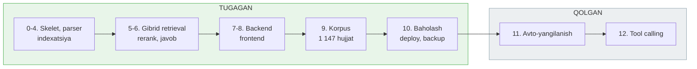

# Loyiha holati

**Sana:** 2026-07-28 · **Oxirgi commit:** `28daeac`

---

## 1. Bir qarashda

Tizim ishlayapti va foydalanishga tayyor. Barcha 12 bosqich yozilgan: korpus
yig'ildi, avtomatik yangilanish va tool calling qo'shildi.

| Ko'rsatkich | Qiymat |
|---|---|
| Reyestrda ro'yxatga olingan | 1 147 hujjat |
| Yuklangan va chunklangan | 1 147 (100%) |
| Indexlangan chunk | **20 497** |
| Noyob modda | 19 333 |
| Qidiruv sifati (recall@5, gibrid) | **0.94** (70 savol) |
| Bosqichlar | 12 dan 12 tasi yozilgan |
| Kod | 21 commit |
| Disk | 0.73 GB |

Ochiq muammolar `VAZIFALAR.md` da — eng muhimi agentik rejim yaqin mavzudagi
normani javob o'rniga qo'yishi.

---

## 2. Korpus tarkibi

| Guruh | Hujjat | Chunk | Indexlangan |
|---|---:|---:|---:|
| Konstitutsiya | 1 | 156 | 156 |
| Kodekslar | 20 | 7 274 | 7 274 |
| Qonunlar | 562 | 12 819 | 12 819 |
| Sud amaliyoti | 564 | 1 452 | **248** |

Sud amaliyotidan faqat 19 hujjat indexlangan: 4 Plenum qarori va 15 sud
amaliyoti sharhi. Qolgan 545 tasi alohida ish bo'yicha qarorlar
("4-1203-2301/1131-sonli iqtisodiy ish") — ular umumiy norma o'rnatmaydi.
Chunklari diskda tayyor turibdi, qaror qabul qilinsa qayta yuklashsiz
qo'shiladi:

```bash
for d in $(cat data/g6_ids_qolgan.txt); do python scripts/index.py --doc-id="$d"; done
```

Prezident hujjatlari, hukumat qarorlari, idoraviy va xalqaro hujjatlar
(~10 800 hujjat) rejadan chiqarildi — sabab `VAZIFALAR.md` da.

---

## 3. Bosqichlar



---

## 4. Qidiruv sifati

`eval/questions.jsonl` da 70 savol: kodekslar, qonunlar va sud amaliyoti,
barchasi haqiqiy moddaga bog'langan va indexga solishtirib tekshirilgan.

| Rejim | recall@5 | recall@10 | MRR |
|---|---:|---:|---:|
| **hybrid** | **0.94** | **0.99** | **0.810** |
| dense | 0.56 | 0.70 | 0.523 |
| sparse | 0.62 | 0.72 | 0.509 |

Savol turlari bo'yicha (gibrid): modda raqami **1.00**, hujjat nomi **1.00**,
sud amaliyoti **1.00**, semantik 0.90.

Avvalgi 50 savollik to'plam 0.98 ko'rsatardi, lekin u faqat kodekslarni
sinardi. Qonun va sud savollari qo'shilgach haqiqiy raqam 0.90 bo'lib chiqdi;
ikkita sistematik xato tuzatilgach 0.94 ga ko'tarildi.

### Korpus kattalashishining narxi

Eval savollari faqat kodekslarga bog'langani uchun keyin qo'shilgan 562 qonun
ular uchun sof shovqin. Bu o'lchashga imkon berdi:

| Rejim | 7 430 chunk | 20 497 chunk |
|---|---:|---:|
| hybrid | 0.98 | **0.98** |
| dense | 0.62 | 0.56 |
| sparse | 0.70 | 0.62 |

Korpus 2.8 baravar kattaydi. Sof vektor qidiruv 6 punkt, sof kalit so'z
qidiruvi 8 punkt yo'qotdi, gibrid esa o'zgarmadi — modda raqami va hujjat
nomi detektorlari nomzodlarni reyting bosqichidan oldin toraytiradi.

---

## 5. Muhim texnik qarorlar

### Embedding lokal modelda
`intfloat/multilingual-e5-base` (768 o'lchov). Gemini bepul tarifi kuniga
1 000 embedding beradi — bu korpus uchun 20 kun. Lokal model bilan kvota
yo'q, pul ketmaydi, internet kerak emas.

### Sparse kodlash n-gramma bilan
O'zbek tili agglyutinativ: so'rovda `poytaxt`, matnda `poytaxti`. To'liq
so'z + 4-belgili n-gramma birgalikda ishlatiladi, MRR 0.327 → 0.475.

### Preamble chunking
Ko'p hujjat butun matnini birinchi modda sarlavhasidan oldin saqlaydi.
Moddalar bo'yicha chunking ularni umuman tashlab ketardi:

| Guruh | Preamble orqali saqlangan |
|---|---|
| Qonunlar | 252 / 562 (45%) |
| Sud amaliyoti | 564 / 564 (100%) |

Ya'ni bu tuzatishsiz 816 hujjat bazaga bo'sh tushardi. `content_hash` ham
preamble'ni hisobga oladi, aks holda moddasiz hujjatlarning hammasida
bir xil xesh chiqib, 11-bosqichdagi o'zgarish aniqlash ishlamas edi.

### Docker
Backend image 2.03 GB. torch CPU indeksidan o'rnatiladi (standart wheel
nvidia kutubxonalarini tortadi, ~4.5 GB bo'lardi), embedding modeli esa
`hf_models` volume'ida — rebuild qilinganda qayta yuklanmaydi.

---

## 6. Avtomatik yangilanish va tool calling

**Bosqich 11 — ishlaydi va sinovdan o'tgan.** `watch.py` rasmiy e'lonlar
tasmasini o'qiydi va qamrovga tegishlilarini ajratadi (oylik oynada 52 hujjatdan
8 tasi). `diff.py` ikki Markdown versiyani modda sarlavhalari bo'yicha
solishtiradi. Sinov: bitta modda qo'lda o'zgartirilganda hujjatning 9 chunkidan
faqat bittasi (`-25531:7:0`) qayta indexlandi.

Xavfsizlik chegaralari: bir kunda 50 dan ortiq hujjat o'zgarsa ish to'xtaydi,
matni yarmidan ko'p qisqargan hujjat o'tkazib yuboriladi va navbatga qo'yiladi.
Kuchini yo'qotgan matn o'chirilmaydi — `status: R` va `valid_to` qo'yiladi.

Rejalashtiruvchi: kunlik 06:00, yakshanba 03:00, oylik — Toshkent vaqti bilan,
har safar snapshot olingandan keyin.

**Bosqich 12 — yozilgan, bitta holatda noto'g'ri ishlaydi.** Beshta vosita
`/api/chat/agentic` ortida. Offline vositalar to'g'ri ishlaydi, live vositalar
lex.uz bilan sinaldi. Lekin model bazada aniq javob bo'lmaganda live qidiruvga
o'tmaydi — batafsil `VAZIFALAR.md`, 1-vazifa.

---

## 7. Ochiq masalalar

**Bitta eval savoli o'tmaydi (34-savol).** Soliq kodeksi 353-moddasining
sarlavhasi shunchaki "Soliq stavkalari" (kodeksda bu nom 4+ marta
uchraydi), matni esa jadval. Sozlash bilan tuzatish mumkin, lekin bitta
savol uchun sozlash — overfitting.

**Plenum qarorlari kam topildi.** `/uz/search/court` tabidan atigi 4 tasi
chiqdi, aslida ular ancha ko'p. Boshqa filtr ostida bo'lishi mumkin,
tekshirilmagan.

**Kirill hujjatlar sinalmagan.** Transliteratsiya funksiyasi yozilgan,
lekin 1 147 hujjatning hammasi lotin yozuvida chiqdi.

**LLM kvotasi cheklangan.** Bepul tarifda har model uchun kuniga 20
so'rov, zanjirda 6 model ≈ 120 so'rov/kun. Eval `ENABLE_QUERY_EXPANSION=false`
bilan ishlatilsa LLM'ga umuman tegmaydi.

**Modern Standby.** Mashinada S0 low-power idle yoqilgan — uzoq fon
jarayonlari uyquda to'xtaydi. Barcha skriptlar uzilishdan tiklanadi
(`run_fetch` yuklanganlarni o'tkazib yuboradi, `index.py` upsert
idempotent), lekin uzun ishlarni bo'lib bajarish kerak bo'ladi.

**`HF_HUB_OFFLINE=1`.** `sentence-transformers` har ishga tushganda
Hugging Face Hub'ga versiya so'rovi yuboradi. Ketma-ket ko'p jarayon
ishlatilsa Hub ulanishni yopadi va model lokal keshda bo'lsa ham
yuklanmaydi. Ko'p marta chaqirishdan oldin shu o'zgaruvchini qo'ying.

---

## 8. Ishga tushirish

```bash
docker compose up -d              # qdrant + backend
```

Brauzerda: **http://localhost:8000**

```bash
bash scripts/backup.sh            # snapshot, indexatsiyadan oldin
python eval/run.py --verbose      # sifat
python scripts/index.py --group N # indexatsiya
```
