<div align="center">


<br>

**Oddiy tilda savol bering — tizim amaldagi qonun moddasini topadi, uni tushuntiradi
va har doim manba ko'rsatadi:** hujjat nomi, modda raqami va lex.uz havolasi.

[](https://www.python.org/)
[](https://fastapi.tiangolo.com/)
[](https://qdrant.tech/)
[](https://ai.google.dev/)
[](https://docs.docker.com/compose/)


[](LICENSE)

**[Qanday ishlaydi](#qanday-ishlaydi)** · **[Interfeys](#interfeys)** ·
**[Nega gibrid](#4-nega-gibrid-qidiruv)** · **[Arxitektura](#3-arxitektura)** ·
**[O'rnatish](#13-ornatish-va-ishga-tushirish)** · **[Kamchiliklar](KAMCHILIKLAR.md)**

</div>

---

## Qanday ishlaydi

Savol yoziladi → modda raqami va hujjat nomi detektorlari ishga tushadi → vektor va
BM25 qidiruvi **parallel** ketadi → RRF birlashtiradi → LLM saralaydi → javob **faqat**
topilgan modda matniga tayanib yoziladi.

<div align="center">
  
</div>

Tizim uch qoida ustiga qurilgan va ularning uchalasi ham **kodda** majburlanadi,
prompt'da emas:

|  | Qoida | Qayerda majburlanadi |
|---|---|---|
| **1** | Javob faqat indexlangan haqiqiy modda matniga tayanadi | `generate.py` · `answer_is_grounded()` |
| **2** | Har bir da'vo yonida manba turadi — hujjat, modda, havola | `generate.py` · `filter_cited_sources()` |
| **3** | Kontekstda javob bo'lmasa — **ochiq aytiladi**, to'qib chiqarilmaydi | `coverage.py` · korpus lug'ati |

---

## Interfeys

<div align="center">
  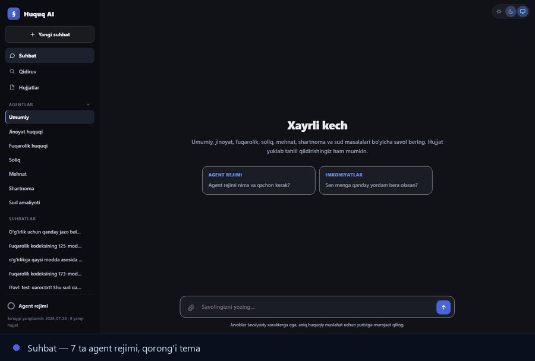
</div>

Vanilla JS, build qadamisiz, 813 qator: SSE streaming, yorug'/qorong'i tema, suhbat
tarixi, hujjat yuklash, manbani bosganda modda to'liq matni modal'da ochiladi.

### Brend


Belgi — qavslar orasidagi modda va uning ikki qatori, ikkinchisi urg'u rangida.
Siyoh `#201E1D`, qog'oz `#F3F2F2`, urg'u `#0088B0` (qorong'i fonda `#62C5EE`).
Nom Source Serif 4 Semibold bilan teriladi, "AI" urg'u rangida.
Interfeysda belgi rasm sifatida emas, HTML ichida chiziladi — shunda u temaga ergashadi.

<br clear="left">

Qoidalar: eng kichik o'lcham 20 px; belgi atrofida uning balandligining yarmiga teng
bo'sh joy; cho'zish, soya, gradiyent va aylantirish mumkin emas; belgiga davlat gerbi
yoki bayrog'i elementlari qo'shilmaydi.

---

## Mundarija

| | | |
|---|---|---|
| [Qanday ishlaydi](#qanday-ishlaydi) | [Interfeys](#interfeys) | [Production](PRODUCTION.md) · [Kamchiliklar](KAMCHILIKLAR.md) · [Monetizatsiya](MONETIZATSIYA.md) |
| [1. Muammo va yechim](#1-muammo-va-yechim) | [7. Qidiruv quvuri](#7-qidiruv-quvuri) | [13. O'rnatish](#13-ornatish-va-ishga-tushirish) |
| [2. Bir qarashda](#2-bir-qarashda) | [8. Javob generatsiyasi](#8-javob-generatsiyasi) | [14. Baholash](#14-baholash) |
| [3. Arxitektura](#3-arxitektura) | [9. Agent rejimlari](#9-agent-rejimlari) | [15. Muhandislik qarorlari](#15-muhandislik-qarorlari) |
| [4. Nega gibrid qidiruv](#4-nega-gibrid-qidiruv) | [10. Agentik rejim](#10-agentik-rejim--tool-calling) | [16. Repozitoriy xaritasi](#16-repozitoriy-xaritasi) |
| [5. Korpus](#5-korpus) | [11. Avtomatik yangilanish](#11-avtomatik-yangilanish) | [17. Kamchiliklar](#17-kamchiliklar) |
| [6. Ma'lumot quvuri](#6-malumot-quvuri) | [12. API](#12-api) | [18. Hissa qo'shganlar](#18-hissa-qoshganlar) |

---

## 1. Muammo va yechim

O'zbekiston qonunchiligi lex.uz da to'liq mavjud, lekin u **hujjat** shaklida turadi:
foydalanuvchi qaysi kodeksning qaysi moddasini ochishini oldindan bilishi kerak. Oddiy
odam esa "meni ishdan bo'shatishdi, nima qilishim kerak?" deb so'raydi — u modda
raqamini bilmaydi.

Sof LLM bu muammoni hal qilmaydi, balki yangisini yaratadi: model qonun matnini
**o'ylab topadi**. Huquqiy sohada bu eng xavfli xato — noto'g'ri modda raqami bilan
berilgan ishonchli javob javob bermaslikdan battar.

Shuning uchun tizim [yuqoridagi uch qoida](#qanday-ishlaydi) ustiga qurilgan — va
ularning hech biri prompt yozuvi bilan cheklanmaydi. Eng yaxshi misol uchinchisi: u
kodda `coverage.py` moduli orqali hisoblanadi
([7.6-bo'lim](#76-coverage--bazada-bunday-tushuncha-yoq)), chunki prompt'ga yozilgan
"bilmasang aytma" qoidasi bu xatoni to'xtatmagan edi.

---

## 2. Bir qarashda

| Ko'rsatkich | Qiymat |
|---|---|
| Reyestrga olingan hujjat | **1 283** |
| Indexlangan chunk | **22 513** |
| Noyob modda | **20 296** |
| Qidiruv sifati — recall@5 | **0.95** (73 savol) |
| Qidiruv sifati — recall@10 | **0.99** |
| MRR | **0.780** |
| Qiyin to'plamda recall@5 | **0.77** (22 savol) |
| Agent rejimlari | 7 ta |
| LLM vositalari (function calling) | 5 ta |
| Kod hajmi | ~7 700 qator (backend, parser, frontend) |
| Ishlash muhiti | 8 GB RAM li noutbuk |

Bularning hammasi **bitta noutbukda** ishlaydi: Qdrant 2 GB, backend 3 GB xotira
chegarasi bilan, embedding modeli lokal, tashqi to'lovsiz.

---

## 3. Arxitektura

Tizim ikki mustaqil qismdan iborat: **offline** korpus quvuri (lex.uz dan Qdrant'gacha)
va **online** savol quvuri (savoldan manbali javobgacha).

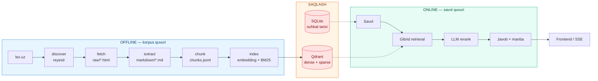

### Texnologiya tanlovi

| Qatlam | Tanlov | Nega aynan shu |
|---|---|---|
| Vector DB | **Qdrant** (Docker) | Dense va sparse vektorni **bitta kolleksiyada** saqlaydi; `on_disk` rejimi 8 GB RAM uchun majburiy |
| Kalit so'z qidiruvi | **Qdrant sparse vectors** (BM25 + IDF) | Alohida Elasticsearch kerak emas — bitta baza, bitta so'rov |
| Embedding | **intfloat/multilingual-e5-base** (768 o'lchov) | Lokal, kvotasiz, pulsiz, ko'p tilli |
| LLM | **Gemini 2.5 Flash** (+6 ta zaxira model) | Rerank, query expansion, javob va function calling |
| Metadata | **SQLite** | Suhbat tarixi; prod uchun Postgres'ga o'tish oson |
| Backend | **FastAPI + Uvicorn**, to'liq async | SSE streaming, `asyncio.gather` bilan parallel qidiruv |
| Parser | **httpx + selectolax** | `BeautifulSoup` dan sezilarli tez |
| Frontend | **Vanilla JS + SSE** | Framework'siz, build qadamisiz, 813 qator |

---

## 4. Nega gibrid qidiruv

Bu loyihaning markaziy texnik da'vosi. Uni bitta jadval isbotlaydi — **bir xil 73 ta
savol, bir xil korpus, faqat qidiruv usuli farq qiladi**:

| Rejim | recall@5 | recall@10 | MRR |
|---|---:|---:|---:|
| **hybrid** — dense + sparse, RRF | **0.95** | **0.99** | **0.780** |
| sparse — faqat BM25 | 0.70 | 0.77 | 0.629 |
| dense — faqat vektor | 0.52 | 0.70 | 0.466 |

<div align="center">
  
</div>

Savol turlari bo'yicha ajratilganda sabab ko'rinadi:

| Savol turi | Misol | hybrid | sparse | dense |
|---|---|---:|---:|---:|
| **Modda raqami** | "FKning 125-moddasi nima haqida?" | **1.00** | 0.13 | 0.13 |
| **Hujjat nomi** | "Mehnat kodeksida ta'til qanday?" | **0.92** | 0.77 | 0.54 |
| **Semantik** | "Ishdan bo'shatilganda nima to'lanadi?" | **0.95** | 0.87 | 0.67 |
| **Sud amaliyoti** | "Plenum muomalaga layoqatsizlik haqida" | **1.00** | 1.00 | 0.67 |

**Xulosa:** sof vektor qidiruv "125-modda" iborasini tushunmaydi — u raqamni semantik
signal deb qabul qilmaydi va 0.13 beradi. Sof BM25 esa "ishdan bo'shatish" va "mehnat
shartnomasini bekor qilish" bir narsa ekanini bilmaydi. Gibrid ikkalasining kuchli
tomonini oladi — **shuning uchun huquqiy qidiruvda gibrid arxitektura tanlov emas,
zaruriyat**.

Birlashtirish **Reciprocal Rank Fusion** bilan qilinadi:

$$\text{score}(d) = \sum_{r} \frac{1}{60 + \text{rank}_r(d)}$$

RRF ballarni emas, **o'rinlarni** birlashtiradi — bu muhim, chunki cosine o'xshashlik
(0–1) va BM25 balli (0–∞) bir xil shkalada emas va ularni to'g'ridan-to'g'ri qo'shib
bo'lmaydi.

---

## 5. Korpus

| Guruh | Hujjat | Chunk | Tarkibi |
|---|---:|---:|---|
| 1 — Konstitutsiya | 1 | 156 | O'zR Konstitutsiyasi (2023-tahrir) |
| 2 — Kodekslar | 20 | 7 274 | JK, FK, MK, SK, JPK, FPK va boshqalar |
| 3 — Qonunlar | 562 | 12 819 | Amaldagi qonunlar |
| 6 — Sud amaliyoti | 515 | 1 231 | Alohida ish qarorlari |
| 9 — Oliy sud / Plenum | 185 | 1 033 | Plenum qarorlari, sud amaliyoti sharhlari |
| **Jami** | **1 283** | **22 513** | |

Barcha hujjatlar `status=Y` (amaldagi) va `minor=N` (yaxlit hujjat) filtri bilan
olingan — ya'ni "falon moddani quyidagi tahrirda bayon etilsin" turidagi foydasiz
o'zgartirish hujjatlari korpusga tushmaydi.

### 9-guruh qanday topilgan

Plenum qarorlarini topish alohida izlanish talab qildi. lex.uz ning `/uz/search/court`
tabi **alohida ishlar** uchun qurilgan: 564 hujjatdan atigi 4 tasi Plenum qarori edi.

Kalit shu bo'ldiki — **Plenum hujjat turi emas, organ**. Umumiy qidiruvni hujjatni
chiqargan organ bo'yicha filtrlash kerak ekan:

```
/uz/search/all?lang=4&status=Y&minor=N&fbody_id=2328   →  185 ta Oliy sud hujjati
```

Bu javob sifatini sezilarli oshirdi: sud amaliyoti savollarida recall@5 = **1.00**.

---

## 6. Ma'lumot quvuri

Xom HTML dan indexgacha to'rt bosqich. Har bosqich alohida ishga tushiriladi va
uzilishdan tiklanadi.

<div align="center">
  
</div>

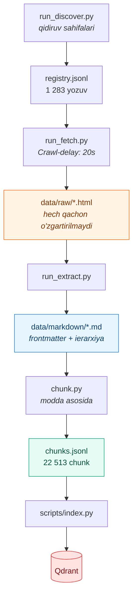

### Nega Markdown oraliq qatlam

`.txt` ishlatilmaydi. Markdown to'rtta narsani beradi:

1. **Ierarxiya saqlanadi** — Bo'lim → Bob → Modda `#`, `##`, `###` orqali
2. **Jadvallar buzilmaydi** — soliq stavkalari va jarima miqdorlari jadvalda bo'ladi
3. **Odam o'qiy oladi** — parser xatosini ko'zdan kechirish oson
4. **`diff` qilish mumkin** — [11-bo'limdagi](#11-avtomatik-yangilanish) avtomatik
   yangilanish aynan shunga tayanadi

Har bir faylda `content_hash` (SHA-256) frontmatter'da turadi — o'zgarish aniqlash
shu orqali ishlaydi.

### Chunking — modda darajasida

Chunk chegarasi sun'iy emas: **har bir modda bitta chunk**. Bu huquqiy matn uchun
tabiiy birlik, chunki norma modda darajasida yashaydi.

```json
{
  "chunk_id": "-111189:173:0",
  "doc_id": "-111189",
  "doc_title": "O'zbekiston Respublikasi Fuqarolik kodeksi",
  "article_no": "173",
  "article_title": "Servitut",
  "chapter": "16-bob. Mulk huquqi",
  "heading": "16-bob. Mulk huquqi\n173-modda. Servitut",
  "text": "...moddaning to'liq matni...",
  "text_for_embedding": "...vektor uchun qisqartirilgan shakl...",
  "source_url": "https://lex.uz/uz/docs/-111189#-154738"
}
```

Uchta muhim tafsilot:

- **1200 tokendan uzun modda** band chegarasi bo'yicha bo'linadi, `part` indeksi oshadi,
  metadata takrorlanadi
- **`source_url` da modda anchor'i bor** (`#-154738`) — havola to'g'ridan-to'g'ri
  o'sha moddaga olib boradi, hujjat boshiga emas
- **Preamble fallback:** ko'p hujjat butun matnini birinchi modda sarlavhasidan
  **oldin** saqlaydi. Bu tuzatishsiz **816 hujjat bazaga bo'sh tushardi** —
  qonunlarning 45% i va sud amaliyotining 100% i

---

## 7. Qidiruv quvuri

Savoldan javobgacha to'qqiz bosqich. Uchtasi — 7.2, 7.4, 7.5 — mahsulot sifatini
o'lchanadigan darajada o'zgartirgan qarorlar.

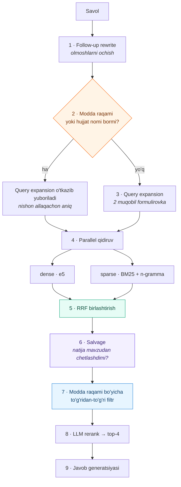

### 7.1 Follow-up rewrite

"Uni pasaytirish mumkinmi?" — bu savolda qidiriladigan hech narsa yo'q. Suhbat
tarixidagi oxirgi 6 xabar asosida savol mustaqil shaklga keltiriladi, keyin qidiriladi.

### 7.2 Modda raqami va hujjat nomi detektorlari

Gibrid RAG ning eng qimmatli qismi. Regex savolda modda raqamini topsa
(`125-modda`, `FKning 125 moddasi`, `289¹-modda`, `173-2-modda`), Qdrant'da
`article_no` bo'yicha **to'g'ridan-to'g'ri filtr** qo'llanadi va natija reyting
boshiga mahkamlanadi.

Hujjat nomi detektori (`aliases.py`) qisqartmalarni tanidi — `FK`, `JK`, `MK`, `SK`,
`JPK` — va lug'at **reyestrdan avtomatik quriladi**, qo'lda yozilmaydi. Shuning uchun
yangi kodeks qo'shilsa lug'at o'zi yangilanadi.

> **Natija:** modda raqamli savollarda recall@5 = **1.00**, sof vektor qidiruvda esa
> 0.13. Bu — arxitektura tanlovining eng aniq o'lchovi.

### 7.3 Sparse kodlash — o'zbek tili uchun n-gramma

O'zbek tili agglyutinativ: so'rovda `poytaxt`, matnda `poytaxti`. Aniq so'z mosligi
bunda ishlamaydi.

Yechim: sparse vektorga to'liq so'z **va** uning 4-belgili n-grammalari (0.35 og'irlik
bilan) qo'shiladi.

| | MRR |
|---|---:|
| Faqat to'liq so'z | 0.327 |
| **+ n-gramma** | **0.475** |

### 7.4 Sarlavha og'irligi

Soliq kodeksida to'rtta modda **aynan** "Soliq stavkalari" deb nomlanadi. Qaysi soliq
ekanini faqat ustidagi bo'lim sarlavhasi aytadi ("XIV BO'LIM. IJTIMOIY SOLIQ").

O'sha qator matnda **bir marta** uchraydi, ostidagi stavkalar jadvali esa yuzlab token.
BM25 ning uzunlik normallashtirishi moddani ajratib turadigan yagona iborani ko'mib
yuborardi.

Yechim: sarlavha chunk'da alohida saqlanadi va sparse vektor qurilganda **3 marta
takrorlanadi**.

| | sparse recall@5 | sparse MRR |
|---|---:|---:|
| Oldin | 0.62 | 0.509 |
| **Keyin** | **0.70** | **0.634** |

> Muhim tafsilot: `text_for_embedding` o'zgarmadi, embedding keshi esa aynan shu
> maydonning xeshiga bog'langan — shuning uchun butun korpus **bitta ham yangi
> embedding qilmasdan** qayta indexlandi.

### 7.5 Salvage — qidiruv mavzudan chetlashganda

Uzun savolning ko'p qismi — har bir moddada uchraydigan umumiy so'zlar ("hisob",
"majbur", "miqdor"). Mavzuni belgilaydigan bitta atama esa o'nlab token orasida
cho'kib ketadi.

Real misol: *"Men TBC bankdan mikroqarz olganman... 50 ming so'm qo'shib qo'yibdi..."* —
tizim soliq penyasi va sud qarorlari haqidagi moddalarni qaytarardi. Chunki "to'lov",
"majburiyat", "miqdor" hamma joyda bor, `mikroqarz` esa 22 513 chunkdan atigi 273
tasida.

Yechim: agar natijaning yuqori 3 tasida savolning **ajratuvchi** so'zlari (korpusda
kam uchraydiganlari) topilmasa, faqat o'sha so'zlar bilan qayta qidiriladi va natijalar
RRF bilan qo'shiladi.

### 7.6 Coverage — "bazada bunday tushuncha yo'q"

Reyting hech qachon ayta olmaydi: bu natijalar **to'g'ri** javobmi yoki shunchaki
**eng yaqin** javobmi. "Bond ombori" so'ralganda tizim "bojxona ombori" (Bojxona
kodeksi) haqida javob berardi — bu haqiqiy norma, chiroyli yozilgan va **noto'g'ri**.

Prompt'ga qoida qo'shish yordam bermadi. Ajratadigan narsa — **lug'at**:

> Agar savolning o'zak so'zi butun korpusda bitta ham chunk'da uchramasa, javob bazada
> yo'q — reyting qanday ko'rinishidan qat'i nazar.

Bu qaror endi `coverage.py` da **kodda** hisoblanadi (`data/corpus_vocab.json`
lug'atiga tayanib) va tool natijasiga `coverage: "weak"` sifatida qo'shiladi. Natija:
"bond ombori" savoli endi lex.uz dan jonli qidiruvga o'tadi, 73 ta eval savolining
birortasi ham noto'g'ri "weak" deb belgilanmaydi.

Savolda modda raqami yoki hujjat nomi bo'lsa tekshiruv o'chadi — u yerda aniq moslik
detektorlari allaqachon nishonni topgan.

### 7.7 Rerank

Top-20 nomzod **bitta so'rovda** Gemini'ga beriladi, 0–10 ballik relevantlik so'raladi,
top-4 tanlanadi. Har nomzod uchun alohida so'rov yuborilmaydi — bu 20 barobar tejaydi.

---

## 8. Javob generatsiyasi

<div align="center">
  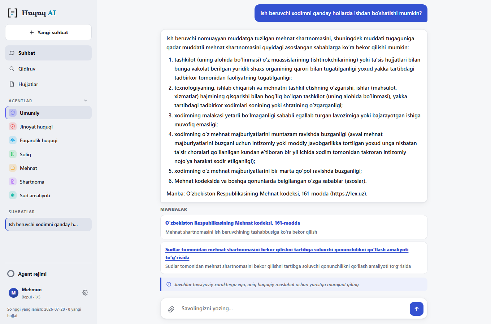
</div>

System prompt to'qqizta qat'iy qoidadan iborat. Eng muhimlari:

| # | Qoida |
|---|---|
| 1 | Faqat berilgan kontekstga tayan |
| 2 | Modda matnini o'zgartirma. Raqam, muddat va summani **aynan** kontekstdagidek keltir. Kontekstda summa yo'q bo'lsa — yo'qligini ayt |
| 3 | Har bir da'vo yonida manba: `(Fuqarolik kodeksi, 173-modda)` |
| 4 | Javob bo'lmasa: *"Bu savol bo'yicha bazada aniq norma topilmadi"* |
| 5 | Yaqin mavzudagi norma javobning **o'rnini bosmaydi** |
| 6 | Savol ko'p qismli bo'lsa — javob beradigan qismini yoz, qolganini alohida ko'rsat |
| 7 | Foydalanuvchi tilida javob ber (o'zbek / rus) |

Uch qo'shimcha mexanizm prompt'ni **kod bilan** mustahkamlaydi:

- **`answer_is_grounded()`** — javobda modda iqtibosi bo'lmasa va "topilmadi" iborasi
  bo'lsa, manbalar ro'yxati **umuman ko'rsatilmaydi**. "Topilmadi" javobi manbalar
  bilan chiqishi mumkin emas
- **`filter_cited_sources()`** — rerank nomzodlarni javob yozilishidan **oldin**
  tanlaydi, shuning uchun bahsda yutqazgan modda ham manba ro'yxatiga tushib qolardi.
  Endi faqat javobda **haqiqatan iqtibos qilingan** moddalar qoladi
- **Vaziyat tahlili formati** — foydalanuvchi o'z holatini bayon qilsa, javob
  *Xulosa → Kvalifikatsiya → Oqibat → Ta'sir qiluvchi omillar → Keyingi qadamlar*
  tuzilishida keladi

Disclaimer modeldan emas, **interfeysdan** keladi — har javob ostida alohida blok
sifatida, model uni yozmaydi.

Salomlashish va "nima qila olasan?" turidagi meta-savollar retrieval'ni butunlay
chetlab o'tadi — ular "topilmadi" javobini olmasligi kerak.

---

## 9. Agent rejimlari

Yettita soha rejimi. Har biri **uch narsani** o'zgartiradi: qidiruv filtri, prompt
qo'shimchasi va **hamroh qidiruvlar** (facets).

| Rejim | Filtr | Hamroh qidiruvlar |
|---|---|---|
| **Umumiy** | filtrsiz | — |
| **Jinoyat** | JK, JPK, JIK | yengillashtiruvchi holatlar · og'irlashtiruvchi holatlar · javobgarlikdan ozod qilish |
| **Fuqarolik** | FK, FPK | da'vo muddati · zararni qoplash |
| **Soliq** | SK | soliq huquqbuzarligi · penya hisoblash |
| **Mehnat** | MK | shartnomani bekor qilish asoslari · nizolarni ko'rish muddati |
| **Shartnoma** | FK | majburiyatni buzganlik uchun javobgarlik · neustoyka |
| **Sud** | FPK, JPK, IPK | shikoyat muddati · da'vo arizasiga talablar |

**Hamroh qidiruvlar nima uchun kerak.** "Men odam o'ldirib qo'ydim" deb yozgan odam
"yengillashtiruvchi holatlar" iborasini ishlatmaydi — lekin javob aynan shu moddalarsiz
to'liq emas. Bu moddalar savolning so'zlari bilan **hech qachon topilmaydi**, shuning
uchun ular alohida qidiriladi va kontekst oxiriga qo'shiladi.

Ular RRF ga **aralashtirilmaydi**: aks holda ular savolga to'g'ridan-to'g'ri javob
beradigan moddalar bilan raqobatga kirib, ularni siqib chiqarardi. Maqsad — asosiy
javob ostiga to'ldiruvchi normani qo'shish, uni yuqoriga ko'tarish emas.

---

## 10. Agentik rejim — tool calling

Standart quvurda qidiruvni **kod** boshqaradi. Agentik rejimda esa modelning o'ziga
beshta vosita beriladi va u qidiruvni o'zi rejalashtiradi:

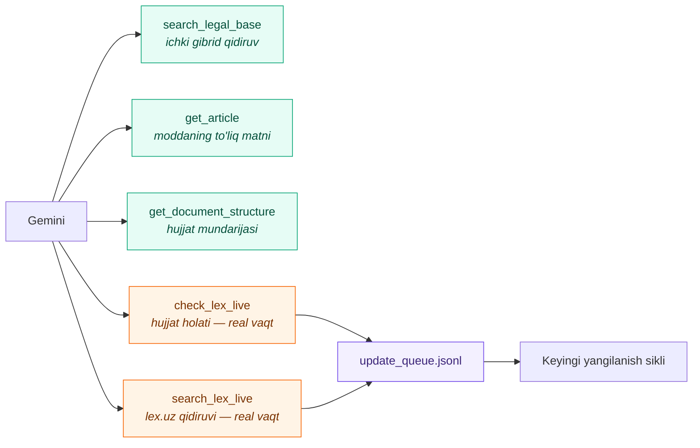

Jonli vositalar **ataylab qiyin ishga tushadi**: ular sekin va lex.uz ga yuk beradi.
Ular asosan `coverage: "weak"` signali kelganda chaqiriladi — ya'ni tizim bazasida
javob **yo'qligini isbotlaganda**.

Eng qiziq qismi — **teskari aloqa halqasi**: agentik rejimda bazada topilmagan hujjat
`data/update_queue.jsonl` ga yoziladi va keyingi yangilanish siklida bazaga qo'shiladi.
Ya'ni **foydalanuvchi savollari tizimni o'zi to'ldirib boradi**.

Bir savol uchun vosita chaqiruvi 5 tadan oshmaydi — bu taklif emas, qattiq chegara.

---

## 11. Avtomatik yangilanish

> Eskirgan huquqiy javob — noto'g'ri javobdan battar. Shuning uchun yangilanish
> tizimning qo'shimcha imkoniyati emas, asosiy qismi.

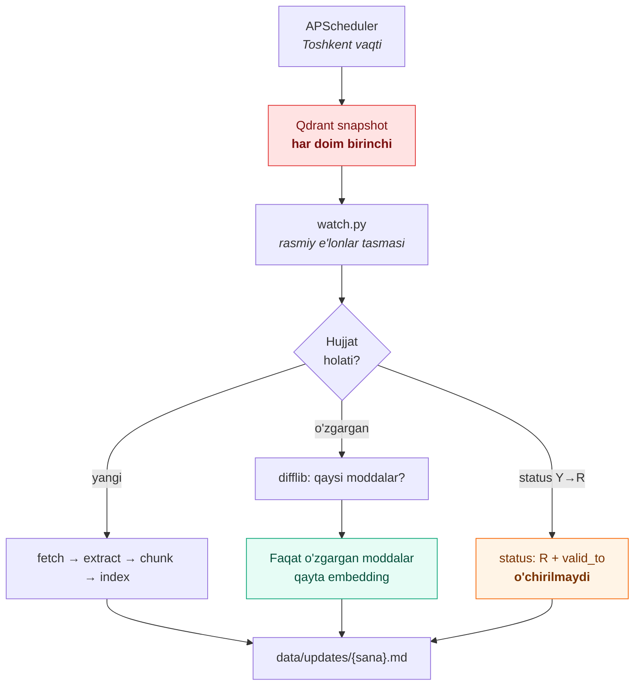

**Delta detection.** Ikki Markdown versiya `difflib` bilan solishtiriladi va `###`
sarlavhalari bo'yicha **qaysi moddalar o'zgargani** aniqlanadi. Faqat o'shalar qayta
embedding qilinadi. Sinovda: bitta modda qo'lda o'zgartirilganda hujjatning 9 chunkidan
**faqat bittasi** qayta indexlandi.

**Jadval:**

| Vazifa | Vaqt |
|---|---|
| Yangi hujjatlar + kodekslar tekshiruvi | Har kuni 06:00 |
| Haftalik to'liq tekshiruv | Yakshanba 03:00 |
| Barcha hujjatlar `content_hash` tekshiruvi | Oyiga bir marta |
| Qdrant snapshot | **Har yangilanishdan oldin** |

**Xavfsizlik chegaralari** — bularsiz bitta parser xatosi butun bazani buzishi mumkin:

- Bir kunda **50 dan ortiq** hujjat o'zgarsa → ish to'xtaydi va tasdiq so'raydi
- Hujjat matni **50% dan ko'proq** qisqarsa → o'tkazib yuboriladi va navbatga qo'yiladi
- Kuchini yo'qotgan hujjat **hech qachon o'chirilmaydi** — `status: R` va `valid_to`
  qo'yiladi, retrieval standart holatda `status=Y` bo'yicha filtrlaydi

Oxirgi qoida "2024-yilda bu modda qanday edi?" turidagi savollarga yo'l ochadi.

Har yangilanishdan keyin `data/updates/{sana}.md` hisoboti yoziladi va u
`GET /api/updates` orqali ko'rinadi; frontend'da "So'nggi yangilanish: ..." yozuvi
sidebar pastida turadi.

---

## 12. API

Ochiq endpointlardan tashqari hammasi avtorizatsiya talab qiladi:
`Authorization: Bearer <token>` yoki `X-API-Key: hq_live_...`.

| Metod | Yo'l | Vazifa | Kirish |
|---|---|---|---|
| `GET` | `/api/auth/config` | Kirish ekrani nimani taklif qilishi (Google yoqilganmi va h.k.) | ochiq |
| `POST` | `/api/auth/phone/start` | O'zbekiston raqamiga SMS kod yuborish | ochiq |
| `POST` | `/api/auth/phone/verify` | Kodni tekshirish, token qaytarish | ochiq |
| `POST` | `/api/auth/google` | Google ID tokenini tekshirish | ochiq |
| `POST` | `/api/auth/complete` | Ism va oferta qabuli — ro'yxatdan o'tishning yakuni | token |
| `POST` | `/api/auth/anon` | Ro'yxatdan o'tmasdan sinab ko'rish | ochiq |
| `GET` | `/api/plans/{key}/quote` | Muddat bo'yicha narxlar (1/3/6/12 oy, chegirma bilan) | token |
| `GET` | `/api/payment-methods` | To'lov usullari va ularning holati | ochiq |
| `POST` | `/api/orders` | Tarif buyurtmasi | token |
| `GET` | `/api/orders` | O'z buyurtmalari | token |
| `DELETE` | `/api/orders/{id}` | Buyurtmani bekor qilish | token · egasi |
| `PATCH` | `/api/sessions/{id}` | Suhbatni qayta nomlash va qadash | token · egasi |
| `POST` | `/api/admin/orders/{id}/confirm` | To'lovni tasdiqlash va tarifni faollashtirish | `X-Admin-Key` |
| `GET` | `/api/plans` | Tariflar ro'yxati | ochiq |
| `GET` | `/api/agents` | Agent rejimlari ro'yxati | ochiq |
| `GET` | `/api/updates` | So'nggi yangilanish hisobotlari | ochiq |
| `GET` | `/health` | Holat + indexdagi nuqtalar soni | ochiq |
| `POST` | `/api/chat` | Savol → **SSE streaming** javob + manbalar | token |
| `POST` | `/api/chat/agentic` | Function calling bilan javob (oqimsiz) | token · Pro+ |
| `POST` | `/api/search` | Faqat retrieval natijasi (debug) | token |
| `GET` | `/api/documents` | Hujjatlar reyestri (`?group=`, `?q=`) | token |
| `GET` | `/api/document/{doc_id}` | Bitta hujjat va uning moddalari | token |
| `GET` | `/api/sessions` | **O'z** suhbatlari ro'yxati | token |
| `GET` | `/api/sessions/{id}` | Suhbat xabarlari va manbalari | token · egasi |
| `DELETE` | `/api/sessions/{id}` | Suhbatni o'chirish | token · egasi |
| `GET` | `/api/account` | Hisob, tarif, kvota, kalitlar | token |
| `GET` | `/api/quota` | Kunlik chegara holati | token |
| `GET` | `/api/usage` | Sarf tarixi va xarajat | token |
| `POST` | `/api/account/keys` | API kalit yaratish | token · Biznes |
| `DELETE` | `/api/account/keys/{id}` | Kalitni bekor qilish | token |
| `DELETE` | `/api/account/data` | Barcha suhbatlarni o'chirish | token |
| `GET` | `/api/legal/{name}` | Oferta, maxfiylik, saqlash siyosati | ochiq |
| `GET` | `/api/admin/stats` | Foydalanuvchilar, xarajat, MRR, marja | `X-Admin-Key` |
| `GET` | `/api/admin/users` | Hisoblar ro'yxati | `X-Admin-Key` |
| `POST` | `/api/admin/users/plan` | Tarifni o'zgartirish | `X-Admin-Key` |
| `POST` | `/api/admin/users/status` | Hisobni bloklash | `X-Admin-Key` |

`/api/admin/*` `ADMIN_API_KEY` qo'yilmagan bo'lsa **404** qaytaradi — mavjudligini ham
bildirmaydi.

Xato javoblari tuzilgan: `{"detail": {"error": "quota_exceeded", "message": "...",
"limit": 5, "reset_seconds": 43200}}`. Kodlar: `401` avtorizatsiya, `402` tarifga
kirmaydigan funksiya, `413` hajm, `429` kvota yoki rate limit.

Himoya: hisob bo'yicha rate limiting, so'rov hajmi chegarasi, `X-Request-ID` bilan
strukturalangan logging, har so'rov uchun latency va **foydalanuvchi bo'yicha** token
va xarajat hisobi.

**SSE oqimi:** `meta` → `token`×N → `sources` → `done`. Manbalar oxirida bitta event
sifatida yuboriladi, chunki ular javob matni yozilgandan **keyin** filtrlanadi. `done`
eventi qolgan kvotani ham olib keladi.

Tariflar, chegaralar va daromad tuzilmasi: **[MONETIZATSIYA.md](MONETIZATSIYA.md)**.

---

## 13. O'rnatish va ishga tushirish

### Tayyor korpus bilan (eng oson)

```bash
cp .env.example .env
# GEMINI_API_KEY va AUTH_SECRET ni to'ldiring:
python -c "import secrets; print(secrets.token_urlsafe(48))"

docker compose up -d                          # qdrant + backend + scheduler
python scripts/import_corpus.py data/releases/corpus-YYYYMMDD.tar.gz
```

Brauzerda: **http://localhost:8000**

Korpus arxivi `scripts/export_corpus.py` bilan yig'iladi. **Buni tushirib qoldirmang:**
noldan qurish lex.uz dan ~7 soat yuklash (`Crawl-delay: 20`) va ~3 soat embedding
degani — bu deploy qadami emas.

### Production

```bash
docker compose -f docker-compose.yml -f docker-compose.prod.yml up -d
```

Caddy TLS sertifikatini o'zi oladi (`DOMAIN` ni `.env` da qo'ying), backend porti
tashqariga chiqmaydi, uvicorn `UVICORN_WORKERS` ta worker bilan ishlaydi. Bu xavfsiz,
chunki yangilanish jadvali alohida konteynerda — aks holda har worker o'z crawl'ini
boshlab, lex.uz bloklardi.

**Ishga tushirishdan oldin majburiy:**

| # | Nima | Nega |
|---|---|---|
| 1 | `AUTH_SECRET` to'ldirilgan | Bo'sh bo'lsa har qayta deployda barcha tokenlar yaroqsiz bo'ladi |
| 2 | `QDRANT_API_KEY` to'ldirilgan | Parolsiz vektor baza — butun korpusni o'chirish imkoni |
| 3 | `ADMIN_API_KEY` to'ldirilgan | Bo'lmasa operator paneli yo'q (endpointlar 404) |
| 4 | `CORS_ORIGINS` aniq domenlar | `*` — har qanday sayt sizning kalitingiz hisobidan so'rov yuboradi |
| 5 | `ENVIRONMENT=production` | Ogohlantirishlar va JSON logging |
| 6 | `docs/legal/` yurist tasdig'idan o'tgan | Huquqiy xizmat, javobgarlik cheklovi kerak |
| 7 | `SMS_PROVIDER=eskiz` va kalitlari to'ldirilgan | `console` da kod faqat jurnalga yoziladi. Production'da tizim buni **rad etadi** — ro'yxatdan o'tish ishlamaydi |
| 8 | `GOOGLE_CLIENT_ID` to'ldirilgan | Bo'sh bo'lsa "Google orqali kirish" tugmasi ko'rsatilmaydi. Production domenini Google Cloud Console'dagi *Authorized JavaScript origins* ga qo'shishni unutmang |

Bu jadval faqat sozlamalar haqida. Server, SMS, to'lov, yurist tasdig'i, monitoring va
korpusning to'ldirilishi — ya'ni **ishga tushirish uchun qolgan hamma ish** —
[PRODUCTION.md](PRODUCTION.md) da tartibi bilan yozilgan.

### Ro'yxatdan o'tishni sozlash

**Google.** [Google Cloud Console](https://console.cloud.google.com) → *APIs & Services*
→ *Credentials* → *Create credentials* → *OAuth client ID* → **Web application**.
*Authorized JavaScript origins* ga sayt manzilingizni qo'shing
(`https://sizning-domen.uz`, dev uchun `http://localhost:8000`). Olingan **Client ID**
ni `.env` dagi `GOOGLE_CLIENT_ID` ga yozing. Client secret kerak emas.

Kirish **popup oqimida** ishlaydi (`google.accounts.oauth2.initTokenClient`): brauzer
access token oladi, backend uni Google'ning `tokeninfo` endpointida tekshiradi —
avvalo token **aynan shu klient uchun** berilganini. Google'ning o'zi render qiladigan
"Sign in with Google" tugmasi ishlatilmaydi, sababi [KAMCHILIKLAR.md](KAMCHILIKLAR.md)
3.9-bandida yozilgan.

**SMS.** [eskiz.uz](https://eskiz.uz) da hisob oching, `ESKIZ_EMAIL` va
`ESKIZ_PASSWORD` ni to'ldiring, `SMS_PROVIDER=eskiz` qo'ying. Xabar shabloni
operatorda oldindan tasdiqlanishi kerak.

**Cheksiz hisob.** `OWNER_EMAILS` dagi pochta bilan Google orqali kirgan hisob
avtomatik `owner` tarifiga o'tadi. Telefon orqali kirgan hisob uchun:

```bash
python scripts/grant_owner.py --phone 901234567
```

### Dev muhit

```bash
py -3.12 -m venv .venv
.venv\Scripts\activate                 # Windows
pip install -r requirements-dev.txt

cp .env.example .env                   # GEMINI_API_KEY ni to'ldiring
docker compose up -d qdrant            # dev'da faqat Qdrant konteynerda

uvicorn backend.app.main:app --reload
pytest                                 # 72 ta test
```

Windows uchun tayyor skript: `.\start.ps1` — port bandligini, Qdrant holatini va
kolleksiya mavjudligini oldindan tekshiradi, telefondan kirish uchun IP manzilni
ko'rsatadi.

### Korpusni noldan qurish

```bash
python parser/run_discover.py --group 2     # reyestr
python parser/run_fetch.py --group 2        # HTML
python parser/run_extract.py --group 2      # markdown + chunks
python scripts/index.py --group 2           # Qdrant
python scripts/build_vocab.py               # korpus lug'ati
```

Guruhlar: `1` Konstitutsiya · `2` Kodekslar · `3` Qonunlar · `6` Sud amaliyoti ·
`9` Oliy sud / Plenum.

### Operatsion qoidalar

Bular tajribada olingan — buzilsa ish qaytadan bajarilishi kerak bo'ladi:

| # | Qoida | Nega |
|---|---|---|
| 1 | lex.uz ga so'rovlar orasida **20 soniya** | `robots.txt` da `Crawl-delay: 20`. Client buni avtomatik bajaradi. Tezlashtirsangiz IP bloklanadi |
| 2 | `HF_HUB_OFFLINE=1` qo'ying | `sentence-transformers` har ishga tushganda Hub'ga so'rov yuboradi; ketma-ket ko'p jarayonda Hub ulanishni yopadi |
| 3 | `text_for_embedding` ni o'zgartirsangiz **butun korpus** qayta embedding qilinadi | Kesh shu maydonning xeshiga bog'langan (~3 soat) |
| 4 | Host'da `index.py` yoki `eval/run.py` dan **oldin** backend konteynerini to'xtating | Ikkalasi ham embedding modelini yuklaydi, 8 GB da sig'maydi |
| 5 | Indexatsiyadan oldin `python scripts/backup.py` | Buzilgan yangilanishdan snapshot orqali qaytish mumkin |
| 6 | Yangi hujjatdan keyin `python scripts/build_vocab.py` | Coverage tekshiruvi shu lug'atga tayanadi |
| 7 | `data/raw/*.html` **hech qachon o'zgartirilmaydi** | Asl manba. Parser xatosi topilsa `run_extract.py` ni qayta ishga tushiring, qayta yuklash shart emas |

### Zaxira nusxa

```bash
python scripts/backup.py            # kunlik nusxa
python scripts/export_corpus.py     # boshqa mashinaga ko'chirish uchun arxiv
```

`backup.py` Qdrant snapshot, SQLite dump va reyestr nusxasini `data/backups/{sana}/`
ga yozadi, oxirgi 5 tasini saqlaydi. Har kuni yangilanishdan **oldin** avtomatik
ishlaydi. `backup.sh` shu skriptga yo'naltiruvchi qobiq — eski odatlar buzilmasligi
uchun qoldirilgan.

---

## 14. Baholash

```bash
python eval/run.py                                          # gibrid
python eval/run.py --mode sparse                            # taqqoslash uchun
python eval/run.py --questions eval/hard_questions.jsonl    # qiyin to'plam
python eval/run.py --verbose                                # har savol bo'yicha
```

Ikkita to'plam ikki xil narsani o'lchaydi:

| To'plam | Savol | Nimani o'lchaydi | recall@5 |
|---|---:|---|---:|
| `questions.jsonl` | 73 | **Topa oladimi** — to'g'ri modda top-5 da mi | **0.95** |
| `hard_questions.jsonl` | 22 | **Bilmasligini bila oladimi** — chegaralar, yolg'on asos, adversarial | **0.77** |

Qiyin to'plam ataylab qiyin: u korpus chegarasini (bazada yo'q savollar), yolg'on
asosli savollarni ("JK ning 500-moddasida nima deyilgan?" — JK da ~404 modda bor),
ikki kodeks chegarasini, prompt injection va so'zlashuv tilini sinaydi. Batafsil
tavsif: [`eval/hard_questions.md`](eval/hard_questions.md).

UI uchun alohida sinov bor:

```bash
python scripts/ui_check.py     # Playwright, 12 tekshiruv
```

### Korpus kattalashishining narxi

Eval savollari faqat kodekslarga bog'langan, shuning uchun keyin qo'shilgan 562 qonun
va sud hujjatlari ular uchun **sof shovqin**. Bu o'lchashga imkon berdi:

| Rejim | 7 430 chunk | 20 497 chunk | 22 513 chunk |
|---|---:|---:|---:|
| **hybrid** | 0.98 | 0.98 | **0.95** |
| sparse | 0.70 | 0.62 | 0.70 |
| dense | 0.62 | 0.56 | 0.52 |

Korpus **3 baravar** kattaydi. Sof vektor qidiruv barqaror pasayadi, gibrid esa deyarli
o'zgarmaydi — chunki modda raqami va hujjat nomi detektorlari nomzodlarni **reyting
bosqichidan oldin** toraytiradi: qo'shilgan hujjatlar raqobatga umuman kirmaydi.

---

## 15. Muhandislik qarorlari

Loyihaning qiziq qismi — bu **sinab ko'rilgan va rad etilgan** g'oyalar. Har biri
o'lchov bilan hal qilingan, taxmin bilan emas.

### Qabul qilinganlar

| Qaror | Muqobil | Sabab |
|---|---|---|
| **Lokal embedding** (`e5-base`) | Gemini API | Bepul tarif kuniga 1 000 embedding — bu korpus uchun **20 kun**. Lokal model: kvota yo'q, pul yo'q, internet kerak emas |
| **Qdrant sparse vectors** | Elasticsearch | Bitta baza, bitta so'rov, bitta konteyner. 8 GB da ikkinchi qidiruv dvigatelini boqib bo'lmaydi |
| **Markdown oraliq qatlam** | To'g'ridan-to'g'ri HTML → chunk | Jadval saqlanadi, ierarxiya saqlanadi, `diff` qilish mumkin |
| **Modda darajasida chunking** | Sobit uzunlikdagi oyna | Huquqiy matnda norma modda darajasida yashaydi — sun'iy chegara javobni buzadi |
| **Embedding keshi** | Har safar qayta hisoblash | Kod o'zgargani uchun 22 513 chunkni qayta embedding qilish ~3 soat oladi |
| **Docker faqat infratuzilma uchun** | To'liq dockerizatsiya | Bitta dasturchi, bitta mashina: rebuild sikli 8 GB da development'ni sekinlashtiradi |

Uchta lokal embedding modeli o'lchandi (10 savol, ground truth bilan):

| Model | O'lchov | recall@5 | MRR |
|---|---|---:|---:|
| **multilingual-e5-base** | 768 | **0.80** | **0.595** |
| multilingual-e5-small | 384 | 0.50 | 0.417 |
| paraphrase-multilingual-MiniLM-L12-v2 | 384 | 0.10 | 0.114 |

### Rad etilganlar

| G'oya | Kutilgan natija | **Haqiqiy natija** |
|---|---|---|
| Chuqurroq fusion havzasi (20 → 100 → 400 nomzod) | recall oshadi | recall **umuman o'zgarmadi** |
| `RRF_K` ni pasaytirish (60 → 3) | reyting o'tkirlashadi | Bitta savolni tuzatib **boshqasini buzdi** |
| Hujjat bo'yicha cheklov (bitta hujjat max N chunk) | Xilma-xillik oshadi | recall **0.96 → 0.91 ga tushdi** |

Uchinchisi ayniqsa qarshi-intuitiv: "bitta hujjat natijani egallab olmasin" degan
qoida mantiqan to'g'ri ko'rinadi. Lekin o'lchov teskarisini ko'rsatdi — natijani
to'ldirib yuborayotgan hujjat odatda aynan **kerakli** hujjat bo'lar ekan.

### 8 GB RAM cheklovi qanday hal qilingan

| Muammo | Yechim |
|---|---|
| Qdrant katta indexda tiqiladi | `on_disk=true`, `on_disk_payload=true`, `mem_limit: 2g` |
| torch standart wheel'i nvidia CUDA kutubxonalarini tortadi | CPU indeksidan o'rnatiladi: image **4.5 GB → 2.03 GB** |
| Embedding modeli har rebuild'da qayta yuklanadi | `hf_models` Docker volume'ida saqlanadi |
| Backend + indexatsiya birga sig'maydi | Indexatsiya paytida konteyner to'xtatiladi |

---

## 16. Repozitoriy xaritasi

```
huquqiy-rag/
├── backend/app/
│   ├── main.py                  FastAPI, lifespan, /health, static mount
│   ├── config.py                pydantic-settings, .env
│   ├── models.py                so'rov/javob sxemalari
│   ├── scheduler.py             APScheduler: kunlik / haftalik / oylik
│   ├── routers/
│   │   ├── chat.py              SSE streaming, agentik yo'l, sessiyalar
│   │   ├── search.py            debug qidiruv, hujjatlar reyestri
│   │   └── updates.py           yangilanish hisobotlari
│   ├── services/
│   │   ├── retrieval.py         dense, sparse, RRF, salvage, modda detektori
│   │   ├── sparse.py            BM25, n-gramma, sarlavha og'irligi
│   │   ├── coverage.py          "bazada bunday tushuncha bormi?"
│   │   ├── aliases.py           hujjat nomi detektori (reyestrdan)
│   │   ├── query.py             modda raqami regex, vaziyat detektori
│   │   ├── rerank.py            bitta so'rovda top-20 → top-4
│   │   ├── generate.py          system prompt, grounding, manba filtri
│   │   ├── agents.py            7 rejim, filtrlar, hamroh qidiruvlar
│   │   ├── agentic.py           function calling bilan javob
│   │   ├── tools.py             5 vosita, jonli lex.uz, yangilanish navbati
│   │   ├── attachments.py       PDF / rasm / DOCX / TXT yuklash
│   │   ├── embedding.py         lokal e5 va Gemini, rate limiter
│   │   ├── llm.py               Gemini wrapper, streaming, model fallback
│   │   ├── auth.py              imzolangan token, API kalitlar, dependency
│   │   ├── plans.py             tariflar va ularning chegaralari
│   │   ├── usage.py             so'rov bo'yicha sarf o'lchovi va kvota
│   │   └── corpus.py            reyestr va chunk indeksi, mtime kuzatuvi
│   ├── middleware.py            request-id, access log, body limit
│   ├── logging_setup.py         structlog + stdlib bitta formatda
│   └── db/sqlite.py             hisoblar, sessiyalar, xabarlar, sarf jurnali
├── parser/
│   ├── lex/
│   │   ├── client.py            robots.txt, kesh, eksponensial backoff
│   │   ├── discover.py          qidiruv sahifalari, ASP.NET pagination
│   │   ├── fetch.py             hujjat sahifasini yuklash va tekshirish
│   │   ├── extract.py           HTML → Markdown, modda ajratish, sup raqamlar
│   │   ├── chunk.py             modda → chunk, preamble fallback
│   │   ├── watch.py             rasmiy e'lonlar tasmasi
│   │   └── diff.py              ikki Markdown versiyani solishtirish
│   └── run_*.py                 discover / fetch / extract / update
├── scripts/
│   ├── index.py                 Qdrant indexatsiyasi, --group, --chunk-ids
│   ├── build_vocab.py           korpus lug'ati (coverage uchun)
│   ├── backup.py                Qdrant snapshot + SQLite dump
│   ├── export_corpus.py         korpusni arxivga yig'ish (deploy uchun)
│   ├── import_corpus.py         arxivni yangi mashinaga tiklash
│   └── ui_check.py              Playwright UI sinovlari (12 tekshiruv)
├── tests/                       72 ta birlik va API testi (pytest)
├── docs/legal/                  oferta, maxfiylik, saqlash siyosati
├── deploy/Caddyfile             TLS, xavfsizlik sarlavhalari, SSE proksi
├── eval/
│   ├── questions.jsonl          73 savol — retrieval sifati
│   ├── hard_questions.jsonl     22 savol — chegaralar va halollik
│   ├── hard_questions.md        qiyin to'plam tavsifi
│   └── run.py                   recall@5, recall@10, MRR
├── frontend/                    vanilla JS chat (SSE, markdown, temalar, uz/ru)
├── data/                        gitignore — korpus, index, keshlar
├── docker-compose.yml           qdrant + backend + scheduler
├── docker-compose.prod.yml      Caddy, ko'p worker, JSON logging
├── MONETIZATSIYA.md             tariflar, birlik iqtisodiyoti, daromad rejasi
└── KAMCHILIKLAR.md              ochiq muammolar
```

---

## 17. Kamchiliklar

Tizimning zaif joylari va ularning sabablari alohida faylda ochiq yozilgan:

### → [KAMCHILIKLAR.md](KAMCHILIKLAR.md)

Qisqacha: dense tomon jadvalli moddalarda ko'r, so'zlashuv tilidan huquqiy atamaga
o'tish bo'shlig'i bor, bitta savolda ikkita modda raqami bo'lsa ikkinchisi yo'qoladi,
LLM bepul tarifi kuniga ~120 so'rov bilan cheklangan.

Xavfsizlik va infratuzilma bandlari 2026-08-01 auditida yopildi — o'sha faylning
0-bo'limida ro'yxati bor.

---

## 18. Hissa qo'shganlar

<div align="center">

<table>
<tr>
<td align="center" width="200">
<a href="https://github.com/toxirerkinov70-commits">

<br>
<sub><b>Toxir Erkinov</b></sub>
</a>
<br>
<sub>muallif</sub>
</td>
<td align="center" width="200">
<a href="https://github.com/UmirzakovD">

<br>
<sub><b>Умирзаков Диор</b></sub>
</a>
<br>
<sub>hissa qo'shgan</sub>
</td>
</tr>
</table>

</div>

---

<div align="center">

**Javoblar tavsiyaviy xarakterga ega.**
**Aniq huquqiy maslahat uchun yuristga murojaat qiling.**

Manba: [lex.uz](https://lex.uz) — O'zbekiston Respublikasi qonun hujjatlari
ma'lumotlar bazasi

Kod [MIT litsenziyasi](LICENSE) ostida. Qonun hujjatlari matni lex.uz ga tegishli va
repozitoriyga kiritilmagan — u parser orqali yig'iladi.

</div>
